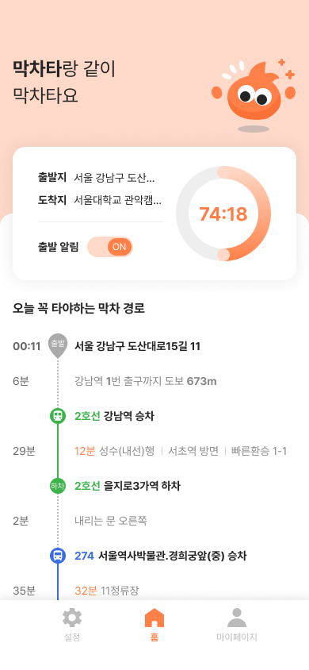
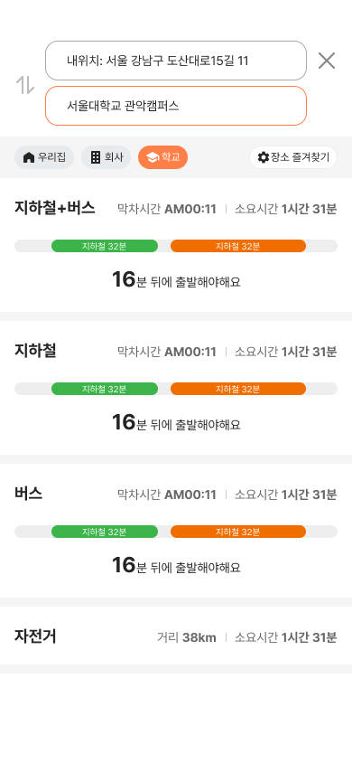
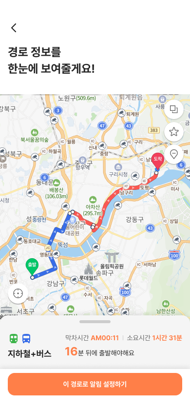

# 막차타


<br/>
<br/> 
막차제작단에 의한  
막차제작단을 위한  
막차제작단의 주말 프로젝트입니다.<br/>
정확한 막차 알림을 직관적이고 따뜻하고 귀엽게 맞춤형으로 알려줍니다!
<br/>막차타고 싶은사람! -> https://makchata.vercel.app/
<br />
<br />

## 🛴 이런 기능이 있어요!

- 출발지와 목적지를 설정해서 언제 자리에서 엉덩이를 떼야 도착할 수 있는지?
- 어떤 교통수단을 이용해야 하는지?
- 얼마를 아꼈는지?
- 심지어 몇 분 전에 도착 하는지 진동으로 알려줍니다!

저희 막차제작단은 여러분의 시간을 <strong>소중하게</strong> 생각하니까요💗

### 한눈에 출발지와 도착지를 확인 할 수 있어요!

<div style='display:flex height : 60%'>
<div style='display:flex '>


</div>
</div>

### 경로를 검색해 막차 정보를 확인해보세요!

<div style='display:flex margin-top:30px'>



</div>

<br/>

## ✋ 사전준비

막차타는 v16 이상의 Node.js 환경에서 실행합니다.

다음 대안 중에 하나를 선택하는 것을 권합니다.

### 버전 관리도구를 통해 설치

- [fnm](https://github.com/Schniz/fnm)
- [nvm](https://github.com/nvm-sh/nvm)

### 직접 설치

[공식 홈페이지](https://nodejs.org/ko/)에서 다운로드하여 설치합니다.

<br />
<br />

## 🐢 실행방법

개발 환경을 실행하기 위해 클론 받습니다.

```bash
git clone https://github.com/makchamakers/makchata.git
```

프로젝트 디렉토리로 이동합니다.

```bash
cd makchata
```

프로젝트가 의존하는 패키지들을 설치합니다.

```bash
npm install
```

개발 서버를 실행합니다.

```bash
npm run dev
```

<br />
<br />

---

## 📚 기술스택

### 프레임워크


다양한 렌더링 전략을 편리하게 사용할 수 있도록 지원하는 메타프레임워크 Next.js를 사용합니다.

### 정적 분석


TypeScript, ESLint, Prettier를 사용하여 코드 품질을 관리합니다.  
Airbnb 스타일 가이드를 기반으로 하여 필요한 규칙을 추가하고, 포맷팅 규칙은 Prettier를 따릅니다.

### 스타일링


글로벌 스타일은 css 사용, 컴포넌트 파일 안에서 스타일을 같이 보는 방식을 선호하여  
styled-components를 사용합니다.

### 상태관리


서버 상태는 React Query, 클라이언트 상태는 Recoil을 사용하여 관리합니다.

<br />
<br />

---

## 💡 막차제작단

| [ ](https://github.com/StandyP) | [ ](https://github.com/wlsud801) | [ ](https://github.com/eun0leee) | [ ](https://github.com/dlsxody1) | [ ](https://github.com/Yang-ah) | [](https://www.github.com/sunaerocket) |
| ---------------------------------------------------------------------------------------------------------------- | ----------------------------------------------------------------------------------------------------------------- | ---------------------------------------------------------------------------------------------------------------- | ---------------------------------------------------------------------------------------------------------------- | --------------------------------------------------------------------------------------------------------------- | ---------------------------------------------------------------------------------------------------------------------- |
| **서디**                                                                                                         | **진진**                                                                                                          | **녕녕**                                                                                                         | **까를로스**                                                                                                     | **엠마**                                                                                                        | **태평**                                                                                                               |
